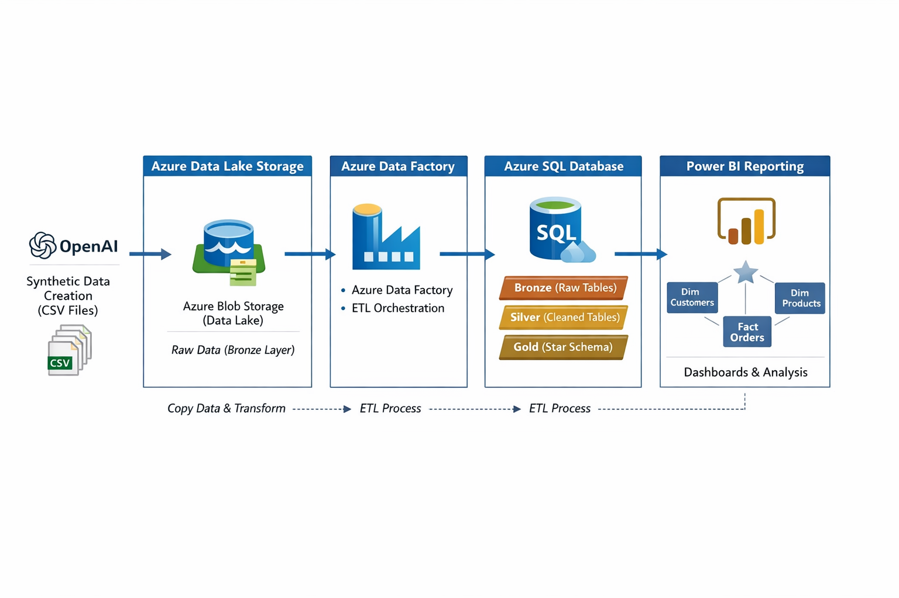
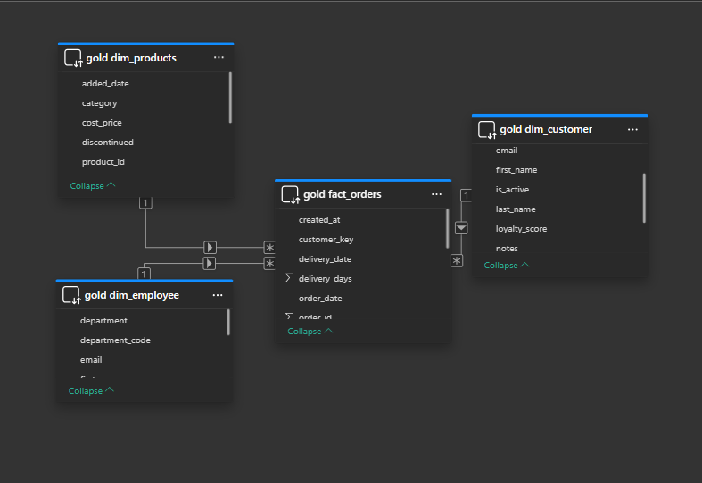
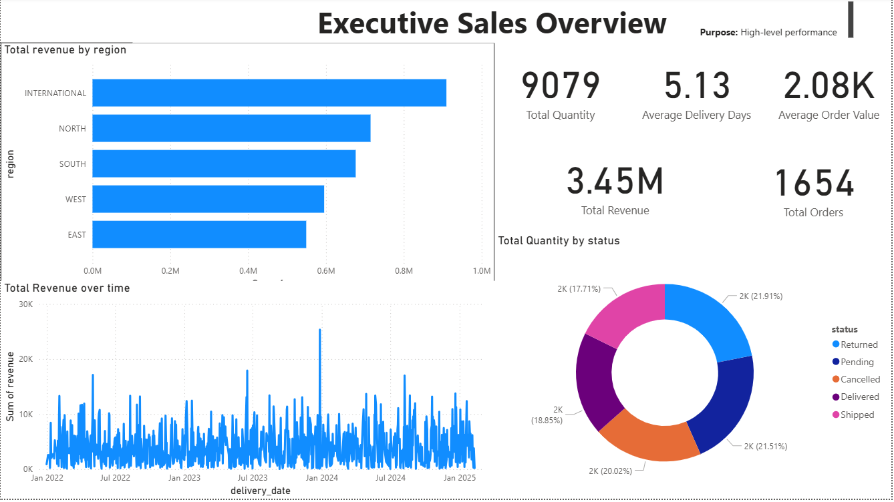
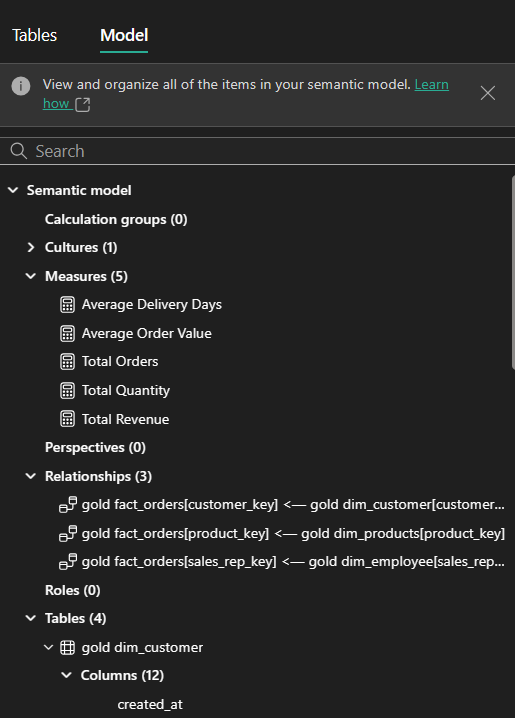

# Azure CRM / ERP Data Engineering Pipeline
## Overview

This project demonstrates an end-to-end Azure data engineering pipeline using synthetic CRM/ERP data. The solution follows the Medallion Architecture (Bronze → Silver → Gold) and delivers business-ready insights through Power BI dashboards using a star schema.

The project simulates a real-world analytics workflow commonly used in enterprise environments.

## Architecture

### Flow:

- Synthetic CSV data generated (Customers, Orders, Products, Employees, Inventory, Invoices)

- Raw data stored in Azure Blob Storage (Bronze)

- Data ingested using Azure Data Factory

- Transformations applied in Azure SQL Database

- Curated Gold layer modeled in a star schema

- Data consumed directly by Power BI

## Data Layers (Medallion Architecture)
### Bronze (Raw)

- Original CSV files ingested as-is

- No transformations applied

- Stored in staging (stg) schema

### Silver (Cleaned & Conformed)

- Data type standardisation

- Trimming, null handling, deduplication

- Referential integrity checks

- Stored in dw schema

### Gold (Analytics-ready)

- Dimensional model (star schema)

- Surrogate keys

- Business metrics calculated

- Optimised for BI consumption

## Gold Schema Design

## Technologies Used

- Azure Blob Storage – Data lake (Bronze)

- Azure Data Factory – Data ingestion & orchestration

- Azure SQL Database – Transformations (Silver & Gold)

- Power BI – Semantic model & dashboards

- T-SQL – Data cleaning, modeling, constraints

- VS Code – SQL development

- GitHub – Version control

## Power BI Dashboards

## Key Learnings & Skills Demonstrated

- End-to-end Azure data engineering pipeline

- Medallion architecture implementation

- Dimensional modeling (star schema)

- Surrogate keys & fact/dimension design

- Data quality handling

- Power BI semantic modeling & DAX

- Business-focused analytics
